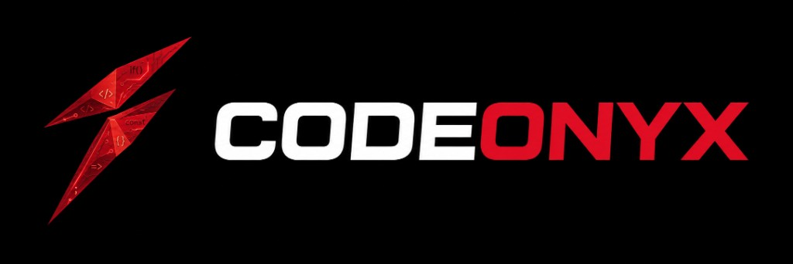

  

Ingeniero en Informática. Desarrollo software y lo dejo funcionando: la interfaz, los datos y el servidor. Empecé con Java, SQL y mantenimiento de equipos; hoy hago sistemas web que están en uso real en instituciones públicas y desarrollo el sitio web de la UPTZ. Disponible para proyectos freelance.

Portafolio, capturas y contacto: **[codeonyx.online](https://codeonyx.online)**

## Qué hago

- Aplicaciones web con TypeScript, React, Next.js y Node
- Backends y APIs con Node y Go
- Java y bases de datos relacionales (PostgreSQL, MySQL, SQLite)
- Android con Kotlin y Jetpack Compose
- Despliegue en servidores Linux con Docker y nginx
- Git como parte del flujo de cada proyecto

## Sistemas en producción

Código privado. Las capturas de cada sistema están en [codeonyx.online](https://codeonyx.online/#proyectos).

| Sistema | Qué es |
| --- | --- |
| [SIGEP + SUI](https://sigep.uptzulia.edu.ve) | Pagos de trámites estudiantiles de la UPTZ: validación, expedientes, cierre de caja, estadísticas y carnetización (React + Go + PostgreSQL) |
| REDAC 1X10 | Registro estadístico y atención al ciudadano: turnos, seguimiento de casos, roles y reportes en Excel y PDF (Next.js + Prisma + PostgreSQL) |
| MediGest | Consultorio médico de escritorio: pacientes, historias clínicas, laboratorios, recetas y agenda; los datos no salen del equipo (React + Node + Electron) |

## Proyectos propios

| Proyecto | Qué es |
| --- | --- |
| [OnyxSync](https://github.com/codeonyx-dev/OnyxSync) | Tareas, carpetas y calendario en una sola app (React + Vite), con sync opcional a Google |
| [OnyxHorario](https://codeonyx-dev.github.io/OnyxHorario/) | Generador de horarios académicos: tablas, logos y exportar PNG/PDF |
| [OnyxBCV-Tasa](https://codeonyx-dev.github.io/OnyxBCV-Tasa/) | Tasas oficiales del BCV en el navegador, con conversión a VES |
| [SpreadVE](https://github.com/codeonyx-dev/spread-ve) | App Android (Kotlin + Compose): BCV, spread P2P, convertidor y widgets |
| [Registro médico](https://github.com/codeonyx-dev/registro_medico) | Historias clínicas de escritorio (Java + MySQL): roles, búsqueda, PDF y estadísticas |

## Stack

## Contacto

[Web](https://codeonyx.online) · [LinkedIn](https://www.linkedin.com/in/raimondcaldera/) · [Instagram](https://www.instagram.com/raimond_caldera/) · [TikTok](https://www.tiktok.com/@codeonyx.dev) · [raimondcaldera1@gmail.com](mailto:raimondcaldera1@gmail.com)

---

